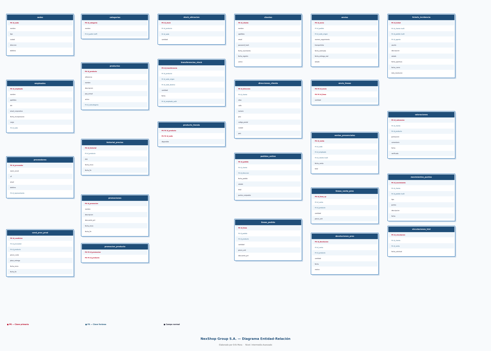

# NexShop Group S.A. — Base de Datos

**Autor:** Juan Antonio Reyes Linares  
**Nivel:** Intermedio-Avanzado  
**Modalidad:** Individual  
**Duración:** 1-2 semanas

---

## Descripción del proyecto

Diseño e implementación desde cero de la base de datos relacional para **NexShop Group S.A.**, una empresa de distribución y venta al por menor con sede en Valencia. Opera con una tienda online (nexshop.es) y una red de tres tiendas físicas en Valencia, Madrid y Barcelona. El proyecto cubre el análisis de requisitos, el modelo ER, el esquema SQL completo y una batería de 14 consultas MySQL.

---

## Estructura del repositorio

```
mi-proyecto-nexshop/
│
├── README.md
├── docs/
│   ├── memoria.docx          ← Memoria de análisis + preguntas de reflexión
│   ├── diagrama_er.png       ← Diagrama Entidad-Relación
│   └── modelo_relacional.pdf ← Notación relacional con PKs, FKs y N:M
├── sql/
│   ├── schema.sql            ← CREATE TABLE, restricciones y FKs
│   └── datos.sql             ← INSERT con datos de prueba realistas
└── consultas/
    └── consultas.sql         ← Las 14 consultas comentadas
```

---

## Diagrama ER



---

## Cómo importar la base de datos

### Requisitos
- MySQL 8.0 o superior

### Pasos

```bash
# 1. Crear la base de datos y todas las tablas
mysql -u root -p < sql/schema.sql

# 2. Insertar los datos de prueba
mysql -u root -p nexshop < sql/datos.sql

# 3. Ejecutar las consultas
mysql -u root -p nexshop < consultas/consultas.sql
```

O bien desde MySQL Workbench: `File → Open SQL Script` y ejecuta primero `schema.sql`, luego `datos.sql` y después `consultas.sql`.

---

## Resumen del modelo

El modelo consta de **25 tablas** que cubren:

- Catálogo de productos con categorías jerárquicas
- Historial de precios y promociones
- Proveedores con histórico de condiciones negociadas
- Stock por ubicación y transferencias internas
- Clientes registrados con múltiples direcciones
- Pedidos online con envíos parciales
- Ventas presenciales en tienda física
- Devoluciones (presenciales y online via ticket)
- Atención al cliente con tickets de incidencia
- Valoraciones de productos (verificadas y no verificadas)
- Programa de fidelización con histórico de movimientos de puntos
- Vinculación de historial presencial anónimo a cuentas online

---

## Relaciones N:M resueltas

| Tabla intermedia | Relación |
|---|---|
| `promocion_producto` | promociones ↔ productos |
| `condiciones_proveedor_producto` | proveedores ↔ productos (con atributos) |
| `producto_tienda` | productos ↔ sedes (disponibilidad) |
| `envio_lineas` | envios ↔ lineas_pedido (envíos parciales) |

